# 코로나 알리미

## 목차  

>   1. [개요](#개요)
>   2. [개발환경](#개발환경)
>   3. [개발방법](#개발방법)

### 개요
- 제작배경
    > 2019년 말부터 유행하던 감염병인 COVID19가 반년 가까이 유행하게 되면서 많은 확진자와 집단 감염 장소가 나오게 되었다.
    > 하지만 이걸 알 수 있는 방법은 재난 안내 문자나 SNS상에 있는 경로 뿐이였고, 이와 관련된 어플을 제작해 보았다.
- 기능
    > 1. 사용자 위치 기준 500m내에 위험지역이 있으면 알림
    > 2. 질병관리본부에서 발표한 집단발생 관련 노출장소 지도에 표시

### 개발환경
- MAC OS 10.15.5  
    >* VSCode

- NodeJS 12.16
    >* axios
    >* cheerio
    >* express
    >* iconv-lite

- React Native
    >* uuidv1
    >* axios 
    >* expo-location
    >* react-native-map

- ETC
    >* T map API
    >* Oracle Cloud Free Tier(Ubuntu 20.04)

### 개발방법
1. NodeJS
먼저 NodeJS를 사용한 이유는 '질병관리본부'에 있는 위험지역을 크롤링한 데이터를 React-native 쪽에 JSON타입으로 제공해주고 싶었다.
그래서 크롤링 + api 서버를 동시에 하기위해 NodeJS를 이용하게 되었다.

아래 명령어를 통해 express-generator를 설치해준다.

    npm i -g express-generator

이후 프로젝트를 생성한다.

    express Project_Name --view=pug

프로젝트를 생성했으면 해당 폴더로 이동하여 express 서버 관련 패키지를 설치해 준다.

    cd Project_Name
    npm i

이후 위처럼 프로젝트를 생성하면 ```app.js```에 기본적으로 라우팅이 되어있다.

```javascript
var indexRouter = require("./routes/index");
var usersRouter = require("./routes/users");

app.use("/", indexRouter);
app.use("/users", usersRouter);
```
이는 사이트 주소 + ```/```와 ```/user```에 대한 라우팅이 되어있는 것이다.
ex)```127.0.0.1:3000/``` ```127.0.0.1:3000/user```


이후 서버를 실행시켜주면 되는데 나는 코드를 변경하며 테스트 하기위해 코드를 변경하면 자동으로 재시작 해주는 nodemon을 설치하였다.


    npm install nodemon -g

이후 ```nodemon start```를 이용하여 서버를 시작해주고 ```localhost:3000```으로 한번 접속해본다.


위와 같은 화면이 나온다면 정상적으로 실행된 것이다.

나는 기본적으로 만들어진 라우팅말고 질병관리본부에서 크롤링해서 가져온 주소를 나타내줄 것이기 때문에 ```routes/location.js```라는 파일을 하나 생성해 주었다.  

이후 질병관리본부에서 GET 메소드로 데이터를 받아와 원하는 부분을 크롤링하여 JSON타입으로 만들어 사이트에 접속하면 볼 수 있도록 해주었다.
```javascript
// routes/location.js
router.get("/", function (req, res, next) {
  getHtml().then((html) => { //GET 메소드로 홈페이지 정보를 가져오는 함수
    var tdList = [];
    var COVIDLoc = [];
    var now = 0;
    const $ = cheerio.load(html);
    const $tbodyList = $("div.box_line2 table.midsize.big tbody tr td"); //원하는 부분만 가져오도록 태그 설정

    $tbodyList.each(function (i, element) {
      tdList[i] = $(this)
        .text()
        .replace(/\(/g, "\n")
        .replace(/\)/g, "")
        .split("\n");
    });

    for (var i = 2; i < tdList.length; i += 5) {
      COVIDLoc[now] = {//Object형식으로 이름, 주소, 날짜를 저장
        name: tdList[i][0],
        address: tdList[i][1],
        date: tdList[i + 1][0],
      };
      now++;
    }
    res.json(COVIDLoc);
  });
});
```
이후 ```app.js```에 아래의 코드를 추가해주고
```javascript
var locationRouter = require("./routes/location");
app.use("/location", locationRouter);
```

```localhost:3000/location```해당 주소로 접속하면 아래와 같은 결과를 볼 수 있다.

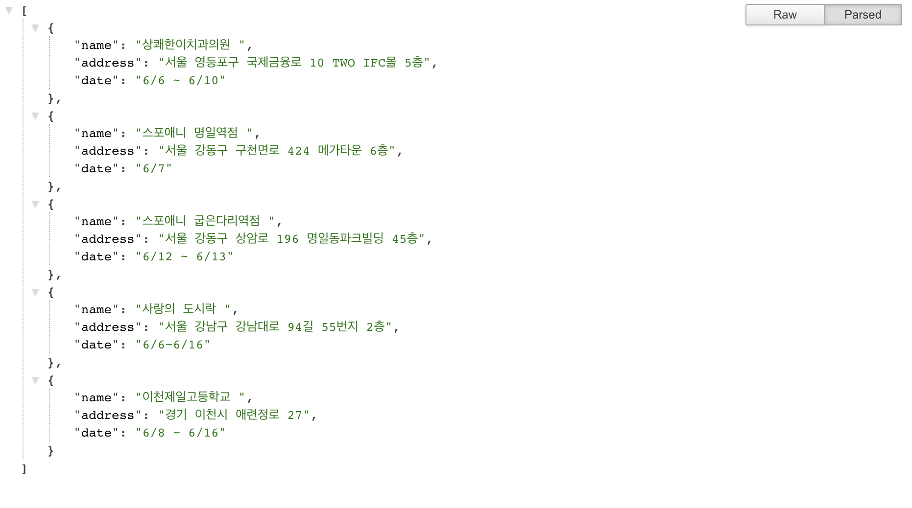

2. 여기부터 분기접
이후 나는 앱을 배포할 생각이 있으므로 내 컴퓨터에서 서버를 돌리는 것이 아닌 AWS같은 서버를 이용하기로 했다.
여러 클라우드 중 오라클 클라우드가 2개까지 무료로 주는것을 알게되었고 오라클에 서버를 생성하게 되었다.

우선 [오라클 클라우드 프리티어](https://www.oracle.com/kr/cloud/free/) 사이트에 접속한다.

접속 후 회원가입을 하고 로그인을 한다.
그럼 아래와 같은 화면이 나오게 되는데 "VM인스턴스 생성"을 눌러준다.

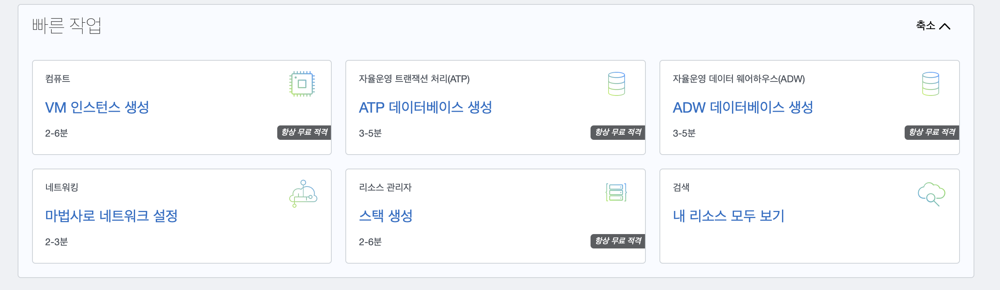

VM인스턴스 생성을 누르면 이처럼 인스턴스를 생성하는 창이 나오게 된다.

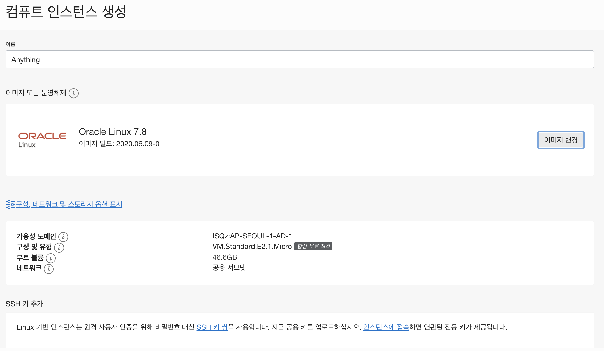

이곳에서 이름, 이미지 또는 운영체제, SSH 키 추가만 하고 생성을 해주면 된다.  

이미지는 20년 6월기준 가장 최신인 Ubuntu 20.04(LTS) 버전을 사용했다.
원하는 이미지 클릭 후 아래 이미지 선택버튼을 눌러주면 된다.

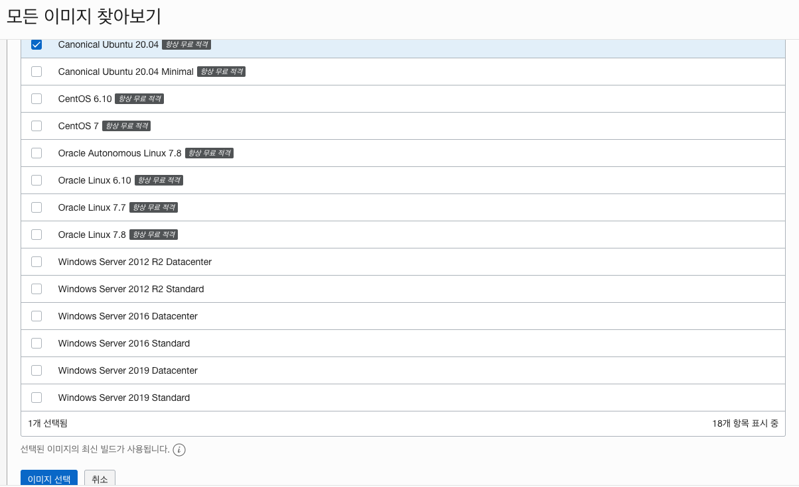

이 후 아래로 내려가 SSH 키 추가를 해주면 되는데

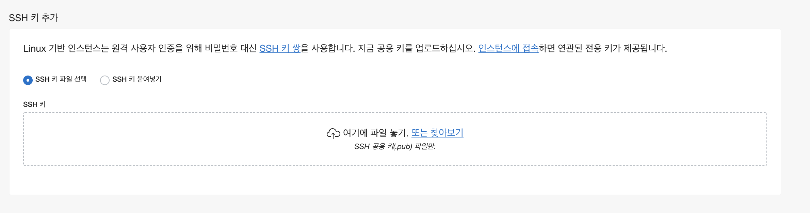  

```cat ~/.ssh/id_rsa.pub``` 명령어를 통해 시스템에 SSH 키가 있는지 확인해준다.  

만약 ```ssh-rsa```로 시작하는 글자가 보인다면 해당 파일을 넣어주면 되고  

``` cat: .ssh/id_rsa.pub: No such file or directory``` 같은 문구가 나오면 키를 생성하여야 한다.

### 키 생성하는 방법(MAC OS 기준)
1. ```ssh-keygen```을 입력  

1. 아래처럼 키 쌍을 저장할 파일 이름을 입력하라고 나오는데 그냥 엔터를 누르면 된다.
    ```Enter file in which to save the key (/Users/.../.ssh/id_rsa):```  

1. 그 다음에는 비밀 번호를 입력하라고 나오는데 그냥 엔터를 누르면 된다.

이후 해당 ```id_rsa.pub``` 파일을 직접 올려주거나 ```cat ~/.ssh/id_rsa.pub``` 을 통해 안에 내용을 넣어주고 생성을 누르면 된다.

이와 같은 창이 나오게된다면 인스턴스 생성에 성공한 것이다.

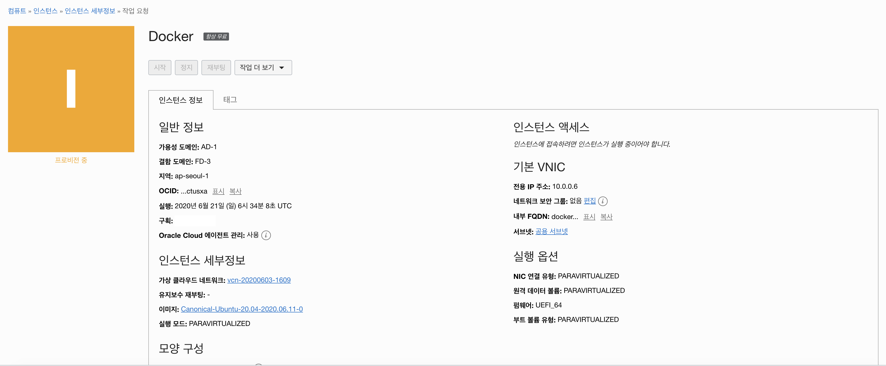  

조금 기다리다 보면 "프로비전 중"에서 "실행 중"으로 변경된다.

실행 중으로 상태가 바뀌게 되면 인스턴스 액세스 부분에 "공용 IP 주소"와 "사용자 이름"이 나오게 된다.  

이를 이용해 ssh [사용자 이름]@[공용 IP 주소] ```ex) ssh test@127.0.0.1``` 입력해 접속해 주면 된다.  
그런데 나는 이 방법으로 접속할 시 비밀번호를 입력하라는 창이 계속 나와서 다른방법을 이용해 주었다.
컴퓨트 - 인스턴스에 들어가면 방금 만든 인스턴스가 보이게되는데 접속해준다.

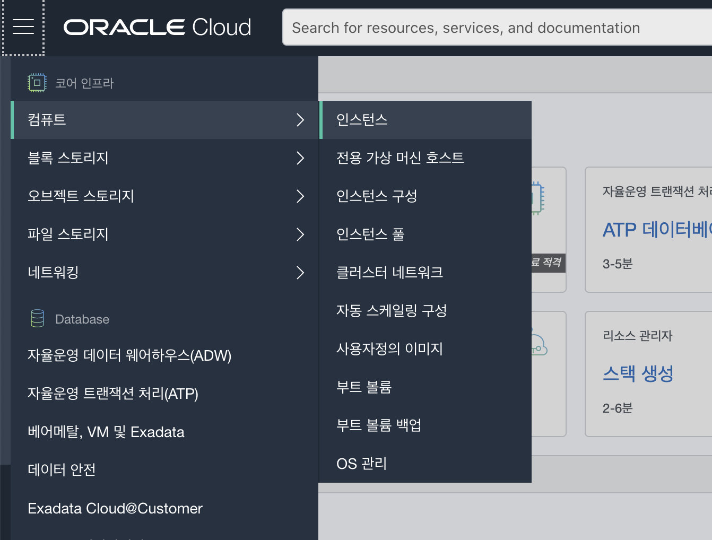 
이후 아래로 내리면 콘솔 접속 이라는 항목이있는데 들어가준다.

  
콘솔 접속에 들어가면 아래와 같이 콘솔접속 생성이라는 버튼이 있는데 눌러준다.

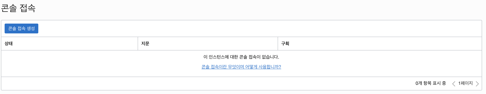  
위에서 넣은 파일인 id_rsa.pub을 여기서도 넣고 콘솔 접속 생성을 눌러준다.

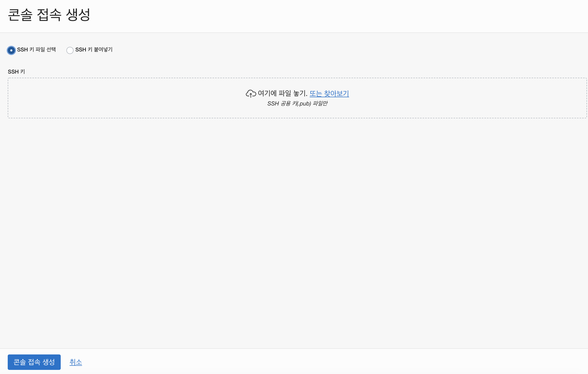  
이후 기다리면 아래처럼 활성이 된다.
좌측에 구획부분에 있는 버튼을 눌러주면 아래처럼 Linux/Mac용 직렬 콘솔 접속 복사 버튼이 있는데 클릭해준 후 터미널에 붙여넣으면 접속이 되었다.

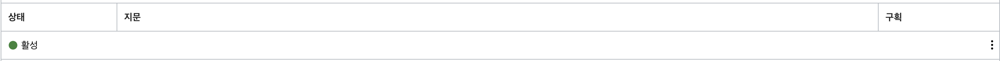  

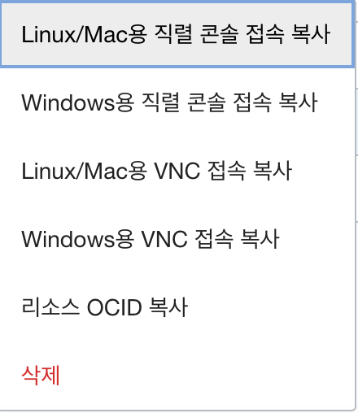  

아래는 서버에 접속이 된 모습이다.
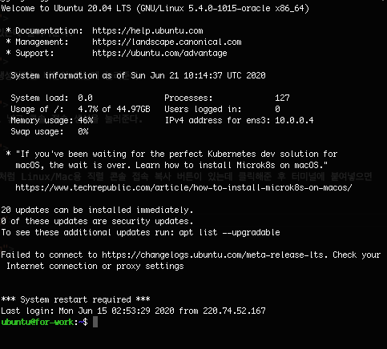  